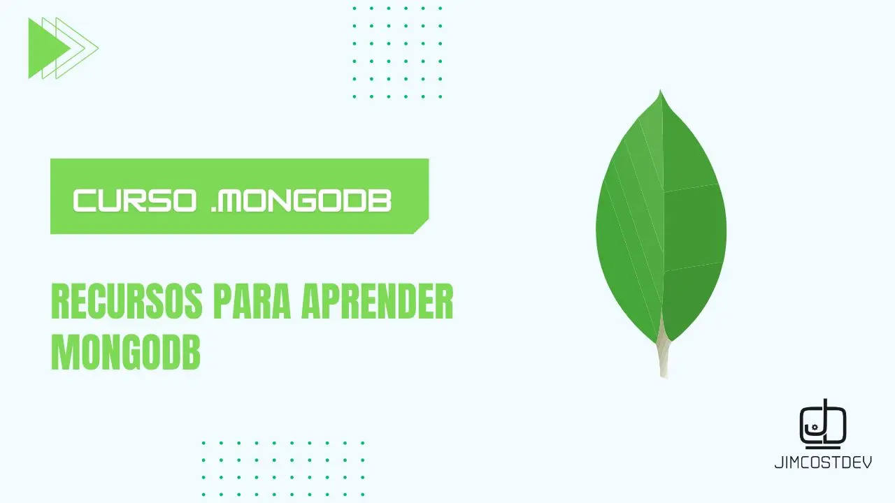

# Guía de Aprendizaje de MongoDB

> !Si te resulta útil este proyecto, apóyalo con una ⭐! Tu apoyo nos motiva a crear más contenido y mejorar los recursos disponibles. ¡Gracias! :octocat:

Este repositorio contiene ejercicios, apuntes y recursos para aprender MongoDB. Está organizado por temas:

1. **learning_path:** Ruta de aprendizaje estructurado para familiarizarte con los conceptos básicos de MongoDB.
2. **workshops:** Talleres prácticos diseñados para profundizar en aspectos específicos (cruds) .
3. **data_modeling:** Recursos y guías para comprender y aplicar técnicas efectivas de modelado de datos.
4. **aggregation-framework:**  Material centrado en el framework de agregación de MongoDB. Es util para operaciones analiticas o de manipulación de datos.

¡Siéntete libre de explorar, aprender y contribuir a este repositorio! Si tienes alguna pregunta, problema o sugerencia, no dudes en contactarme.

**Happy coding! 🚀**

